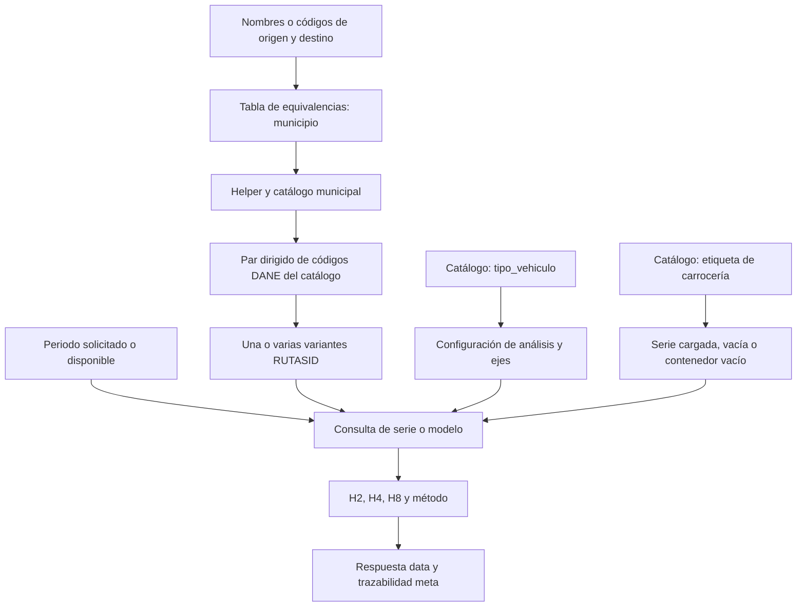

# Relaciones que usa una consulta SICETAC

Este mapa describe relaciones lógicas verificadas en `sicetac_service.py`, `sicetac_helper.py`, `supabase_data.py` y `commercial_api.py`. No afirma que todas estén implementadas como claves foráneas en la base.

## De la solicitud al resultado

## Identidades y relaciones

| Entrada o identidad | Relación | Qué debe conservar el integrador |
| --- | --- | --- |
| Nombre/alias municipal | La tabla de equivalencias determina el municipio; el helper confirma contra el catálogo y produce el DANE | Municipio, departamento y DANE del catálogo; un código SICE del alias no sustituye esa resolución |
| `codigo_dane_origen`, `codigo_dane_destino` | El consumidor puede enviarlos para verificar; el helper no deja que un código incorrecto cambie el municipio | Códigos como texto y `resolved_route.route_code` |
| OD | Puede tener varias rutas/vías oficiales | `RUTASID`, nombre y vía elegidos; no usar OD como identificador único de variante |
| `vehiculo` | Se relaciona con fila del catálogo, configuración de análisis/lookup y ejes | Código solicitado y configuración devuelta |
| `carroceria` | Selecciona una categoría y columnas de costo asociadas | Etiqueta exacta y opción/columna efectiva si viene informada |
| `modo_viaje`, `tipo_contenedor` | Distinguen vehículo vacío de contenedor vacío transportado | Estado y contexto del viaje |
| `mes` | Determina el periodo solicitado; al omitirlo se aplica la disponibilidad del servicio | Periodo efectivo y `mes_parametros`; pueden diferir según método |
| Ruta + configuración + carrocería + modo + periodo | Determinan búsqueda de valores disponibles o cálculo soportado | `metodo`, `detalle_lookup`, variantes y totales que devuelve el servicio |
| Ruta + categoría física de peaje | Relacionan peajes de la vía con el vehículo | Detalle y alcance si se solicita; no duplicar componentes en el total |
| `consumer_id` | Identifica al consumidor autenticado y su plan/cuota | `meta.consumer_id`, `request_id` y consumo; nunca la clave en los resultados |

La API acepta códigos DANE como texto. El orden de resolución es: equivalencia operativa → municipio → helper del catálogo. `68276` y `68276000` son el mismo municipio. El catálogo comercial devuelve la forma de 8 dígitos que produce el helper. Reutiliza ese valor; no fabriques un código a partir del nombre ni uses un código SICE del alias como llave de búsqueda.

## Fuentes del servidor

Los nombres pueden cambiar por variables `SICETAC_TABLE_*`; estas son las relaciones lógicas configuradas por defecto en `supabase_data.py`:

| Fuente lógica | Tabla por defecto | Función |
| --- | --- | --- |
| Municipios | `municipios` | Identidades, nombres y aliases |
| Vehículos | `configuracion_vehicular` | Configuraciones y ejes |
| Rutas | `rutas` | OD, variantes y distancias |
| Parámetros | `parametros_vigentes` | Parámetros del cálculo por configuración/periodo |
| Costos fijos | `costos_fijos_vigentes` | Base de costos del modelo |
| Movilización | `sicetac_movilizacion_vigentes` | Series disponibles para consulta resumida |
| Valor hora | `sicetac_valorhora_vigentes` | Componente horario de las series |
| Vacío | `sicetac_vacio_vigentes` | Valores de la modalidad vacía |
| Peajes | `peajes_vigentes` y fuentes de detalle/resumen/inventario | Costo y composición de peajes |
| Valor en plaza | `valor_en_plaza_mensual_descriptiva` | Referencia diferenciada cuando existe cobertura |
| Valor en plaza portuario | `valor_en_plaza_puertos_desagregada` | Capa privada por ruta, configuración y segmento `contenedor_cargado`/`contenedor_vacio`/`carga_general`; conserva los dos meses más recientes y marca la segmentación como proxy |
| Resumen portuario por rango | `valor_en_plaza_puertos_rangos_vehiculo` | Promedios ponderados y mediana por puerto, configuración y rango C2 proxy; se usa para análisis agregado, no como llave de cotización |

Las dos tablas portuarias están en `public` con RLS activo, sin políticas ni grants para `anon`/`authenticated`; únicamente el servidor con `service_role` las consulta. En una ruta cuyo origen sea uno de los puertos cubiertos, la API prefiere la capa portuaria por ruta/configuración/segmento y limita la serie a dos meses. Para C2 selecciona el rango con más viajes reportados por mes y lo devuelve explícitamente como proxy de toneladas, no como PBV. Si no hay cobertura, conserva el fallback histórico. El cliente obtiene el resultado mediante la API; no necesita replicar estas tablas ni acceder a ellas. El helper no crea rutas que no existan, no acredita transitabilidad actual y no habilita cuentas comerciales.

## Relación con la selección de vehículo

La configuración SICETAC describe una alternativa de cálculo. Para recomendarla al usuario se requieren también capacidad útil, volumen, dimensiones, estibas, compatibilidad de carrocería, accesos y disponibilidad.

Los catálogos públicos no aportan todos esos atributos físicos. Cruza sus códigos con la ficha de flota o proveedor del cliente usando una correspondencia validada. No asignes toneladas útiles a partir del PBV, del número de ejes o del nombre coloquial.

Primero identifica candidatos factibles; luego consulta cada configuración y compara el costo de transportar la misma carga, incluyendo cantidad de viajes. Si falta una capacidad determinante, la recomendación queda condicional.

## Qué no se puede deducir

- Una variante inversa no demuestra que ida y regreso tengan costos o restricciones iguales.
- Dos vehículos con diferentes costos por viaje no son comparables si transportan cantidades distintas sin ajustar viajes.
- Un catálogo con una configuración no garantiza valores para cualquier ruta, carrocería, modalidad y periodo.
- Una consulta de costo no certifica cumplimiento operativo, disponibilidad física ni autorización de despacho.
- Una respuesta de salud no demuestra que datos, autenticación y cuotas estén operativos de punta a punta.
