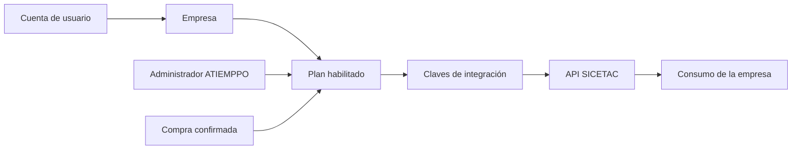

# Portal de clientes para la API SICETAC

Fecha: 24 de septiembre de 2026. Estado: propuesta de producto y ejecución para revisión.

Objetivo: que una empresa pueda acceder al portal, obtener un plan habilitado por ATIEMPPO o mediante compra, gestionar sus claves y consultar su consumo. ATIEMPPO conserva la administración de empresas, permisos, planes y suspensión del servicio.

Este documento registra el plan. La revisión fue de código y documentación local; no acredita configuración productiva, sesiones reales ni pagos. No se implementaron funciones, migraciones ni despliegues en esta revisión.

## 1. Punto de partida comprobado

| Componente | Evidencia local | Uso propuesto |
| --- | --- | --- |
| API HTTP y puente MCP | `commercial_api.py`, `commercial_client.py`, `commercial_mcp_server.py` | Conservar el servicio y los contratos de cálculo. |
| Claves comerciales | `scripts/generate_api_key.py` y `require_consumer` | Reutilizar generación aleatoria y verificación por hash; agregar gestión web. |
| Consumidor y cuota | `api_consumers`, `_reserve_unit`, migraciones de reserva | Conservar identidad comercial, historial y reserva atómica; verificar persistencia real antes del piloto. |
| Consumo | `api_usage_events` y `GET /v1/usage` | Alimentar resumen e historial del cliente mediante autorización de sesión. |
| Portal de clientes | `/Users/atiemppoia/codex/PORTAL-CLIENTES-ATIEMPPO` | Extender el portal existente con el producto API SICETAC. |
| Identidad y empresas del portal | Supabase Auth, `clients`, `client_memberships`, `portal_admins` | Reutilizar identidad y empresas, con permisos específicos para API. |
| Acceso actual del portal | `src/app/login/actions.ts` exige acceso previo para el enlace mágico | Agregar solicitud de alta pendiente; abrir registro exige un flujo nuevo. |
| Compras y gestión web de claves | Sin implementación encontrada en las rutas y modelos inspeccionados | Construir ambas capacidades. |

El modelo actual de la API guarda una clave dentro del consumidor. Un portal con varias claves requiere separar la empresa consumidora de sus credenciales. Tampoco se encontró límite de ráfagas en el código revisado; la cuota mensual debe complementarse con límites por tiempo.

## 2. Decisión de arquitectura propuesta

Mantener tres responsabilidades coordinadas:

- **Web pública ATIEMPPO:** explicación del servicio, beneficios, planes y entrada a solicitud/compra.
- **PORTAL-CLIENTES-ATIEMPPO:** identidad del usuario, empresas, pantallas de cliente y administración. Sección propuesta `/clientes/api-sicetac`.
- **SICETAC-API-MCP:** cálculo, consumidores comerciales, claves, planes efectivos y medición. Este proyecto conserva el plan de evolución de la API.

No crear otra tabla de organizaciones en el portal: `clients` ya representa empresas. El registro de proyectos identifica al portal y a la API como proyectos distintos; se coordina su integración manteniendo sus responsabilidades.

Los proyectos Supabase del portal y de la API deben verificarse antes de implementar. Si son distintos, vincular explícitamente `portal_client_id` con `consumer_id`, sin suponer consultas SQL entre bases ni aceptar automáticamente tokens de otro proyecto. El plan no requiere fusionar bases.

La cuenta identifica a la persona. La empresa es dueña del plan y del consumo. Las claves identifican integraciones y pueden reemplazarse sin cambiar el saldo. Iniciar sesión o crear una clave no concede por sí solo derecho de uso.

## 3. Recorridos del cliente y del administrador

### Cliente habilitado por ATIEMPPO: primer lanzamiento recomendado

1. ATIEMPPO registra o selecciona la empresa y autoriza a su responsable.
2. El administrador asigna plan, cuota finita, vigencia y límites de solicitudes.
3. El cliente entra al portal con su identidad verificada y selecciona su empresa.
4. En “Mi API” ve su plan, consumo, saldo y fecha de vencimiento.
5. Crea una clave con nombre, por ejemplo “Integración ERP”, y permisos admitidos por su plan.
6. Copia la clave en ese momento, conecta su sistema y realiza una consulta de prueba.
7. Puede revisar el consumo, reemplazar la clave o revocarla según su rol.

ATIEMPPO también podrá generar una clave para una empresa desde administración. La acción queda atribuida al administrador; la entrega se hace por un mecanismo seguro definido en la implementación. Nunca se podrá consultar de nuevo una clave existente en texto completo. Para la operación habitual, conviene que el cliente genere y copie su propia clave.

### Solicitud o reserva de plan

Interpretación provisional de “separar”, pendiente de confirmar con Juan: registrar interés en un plan para aprobación o pago posterior.

El usuario verifica su correo y presenta empresa, contacto y plan solicitado. La solicitud queda pendiente, con fecha y estado visibles. La solicitud no habilita consultas. Si se desea reservar precio o vigencia comercial, habrá que definir esas condiciones antes de ofrecerlo en pantalla.

El registro de un solicitante nuevo no lo incorpora a empresas existentes por dominio de correo, nombre o NIT. La vinculación exige invitación o revisión. Tampoco concede acceso a reportes de otros productos del portal.

### Compra automática: etapa posterior

1. Cliente autenticado selecciona un plan publicado.
2. El servidor crea una orden con empresa, importe, moneda, versión del plan y vigencia.
3. El cliente paga en la página de la pasarela.
4. El servidor verifica la confirmación del proveedor y su correspondencia con la orden.
5. La activación se aplica una sola vez, con evidencia de pago y registro de auditoría.
6. El cliente puede generar su clave y comenzar a consumir.

Volver a una pantalla de “pago exitoso” no activa el plan. Si el pago está aprobado pero la activación falla, la orden muestra “activación pendiente” y permite conciliación sin volver a cobrar. Pagos rechazados, pendientes y cancelados tienen estados distintos. Las reglas de renovación, devolución y suspensión se definirán antes del lanzamiento de pagos.

## 4. Pantallas de la primera versión

| Pantalla | Contenido y acciones |
| --- | --- |
| Acceso / solicitud de alta | Inicio de sesión, verificación del correo, invitación o solicitud pendiente. |
| Mi API | Empresa activa, plan, estado, consumo, saldo, período y guía de primera conexión. |
| Mis claves | Nombre, prefijo, creación, vencimiento, último uso y estado; crear, reemplazar y revocar. |
| Consumo | Total del período, uso por día y clave, errores relevantes y límites alcanzados. |
| Plan | Cuota, vigencia y condiciones; solicitar cambio. Compra en línea en la etapa de pagos. |
| Administración | Empresas, solicitudes, responsables, planes, claves, suspensiones y auditoría. |

Estados que deben diseñarse: empresa sin plan, plan pendiente, plan vencido, cuenta suspendida, cuota agotada, límite temporal alcanzado, clave revocada y servicio temporalmente no disponible.

## 5. Permisos

| Actor | Facultades propuestas |
| --- | --- |
| Administrador ATIEMPPO autorizado para API | Habilitar o suspender empresas, asignar planes/cuotas, gestionar claves y consultar auditoría. |
| Administrador de empresa | Gestionar claves y responsables autorizados dentro de su empresa; consultar plan y consumo. |
| Integrador autorizado | Crear/reemplazar/revocar claves dentro del alcance concedido; leer documentación y consumo permitido. |
| Consulta | Ver plan y consumo de su empresa; sin cambios de claves, miembros ni condiciones. |

Los roles actuales de reportes no conceden automáticamente administración de API. El permiso de integrador es una capacidad nueva, no un rol existente confirmado. El servidor verifica identidad, empresa, membresía vigente y permiso en cada operación; el navegador no decide esas facultades.

## 6. Evolución de datos y claves

Propuesta para detallar antes de las migraciones:

- Mantener `clients` y `client_memberships` como identidad empresarial del portal.
- Mantener `api_consumers` y sus `consumer_id` como cuenta de consumo, agregando un vínculo verificado con la empresa del portal.
- Crear `api_keys` separada: consumidor, identificador, nombre, prefijo, hash, permisos, creador, vencimiento, revocación y último uso.
- Crear planes versionados y asignaciones con estado, inicio, fin, cuota, límites de solicitudes y máximo de claves activas. La cuenta de la API es la autoridad para habilitar consultas; el portal muestra ese estado.
- Conservar `api_usage_events`; agregar identificador de clave para atribución, sin almacenar el secreto.
- Registrar auditoría administrativa: actor, empresa, acción, fecha, motivo y cambios de condiciones sin secretos.
- En la etapa de compra: órdenes, eventos de pago y registros de activación/reconciliación.

Todas las claves de una empresa comparten la cuota asignada a ese servicio. Crear, rotar o revocar claves no reinicia ni multiplica el saldo. Proponer una cuenta por empresa y producto en la primera versión; si se requieren subcuentas, definir reparto explícito de cuota.

Conservar provisionalmente el mes calendario UTC que usa hoy `_month_key()`. Antes de vender planes, decidir si se mantiene ese período o se cambia a ciclos desde la compra, y cómo se trata el primer mes. La pantalla debe mostrar inicio y fin exactos. Precios, cuotas y límites numéricos están por definir con uso y capacidad medidos.

La migración debe ser aditiva: trasladar hashes de claves existentes sin conocer sus secretos, mantener consumidores e historial, comprobar el reconocimiento de las claves actuales y retirar la compatibilidad anterior solo después de verificar la nueva ruta. Si se revoca una clave, ninguna ruta de compatibilidad puede volver a aceptarla.

## 7. Condiciones técnicas para habilitar el piloto

1. **Sesión confiable para gestionar claves.** El portal actual admite una cookie propia como alternativa a Supabase Auth. `src/lib/portal-session.ts:96` contempla secretos con prefijo público e incluso una clave publicable como alternativa de firma. Esto requiere corregir o excluir esa vía en operaciones de claves y administración; no se afirma aquí que esa configuración esté activa en producción. Exigir sesión verificable en servidor, identidad estable por `auth.users.id`, revocación, expiración y protección frente a solicitudes falsificadas. MFA para administradores y nueva verificación para acciones sensibles.
2. **Autorización por empresa y producto.** Las nuevas rutas fallan cerradas si falta configuración, sesión, permiso o plan. No heredar el modo de demostración local. Mantener aislamiento mediante políticas de base de datos y controles del servidor; el acceso privilegiado del backend también debe comprobar la empresa.
3. **Claves protegidas.** Generación aleatoria en servidor, hash persistido y texto completo visible una sola vez, sin caché ni registro en logs. No se introduce la clave del consumidor en el código público del portal. Los secretos de administración y `service_role` permanecen en servidores. Límite de claves activas y auditoría de emisión, reemplazo y revocación.
4. **Contrato portal–API.** Gestión separada de las rutas de cálculo, con autenticación y autorización de usuario. Si los proyectos Auth son distintos, verificar firma, emisor, audiencia y vigencia del token contra el emisor autorizado y consultar membresía vigente. Un correo o `client_id` enviado por el navegador no demuestra permiso. No reutilizar un token administrador global para identificar personas.
5. **Protección de tráfico.** Limitar IP antes del trabajo costoso de autenticación y aplicar límites de consumidor y concurrencia antes del cálculo. Contador compartido y atómico entre procesos/instancias; seleccionar almacenamiento tras verificar infraestructura y carga. Cubrir entradas públicas, claves inválidas y gestión de claves. El bloqueo temporal comunica cuándo reintentar y no consume cuota de cálculo.
6. **Cuota duradera.** Verificar reservas atómicas y persistencia real. La autenticación, los catálogos y el portal también requieren protección de tráfico aunque no consuman una cotización. Un fallo de medición no habilita consumo ilimitado.
7. **Compatibilidad pública.** Inventariar WhatsApp, web y demás consumidores de `/consulta` y rutas relacionadas. Definir límites y acceso público limitado o migración autenticada para evitar eludir los planes. Ejecutar los cambios por consumidor con prueba de paridad.
8. **Observabilidad.** Medir errores, latencia, consumo, rechazos por cuota/ráfaga y operaciones administrativas. Mostrar identificadores de solicitud útiles para soporte. Conservar el criterio actual de cobro por admisión al cálculo hasta revisarlo; documentar que un timeout no se reintenta automáticamente.

## 8. Entregas y criterios de cierre

| Etapa | Entrega | Se considera terminada cuando |
| --- | --- | --- |
| 0. Diseño verificable | Recorridos, pantallas, roles, reglas de cuota y contrato de integración; inventario de claves y consumidores sin secretos | Cada acción tiene actor, permiso, estado y responsable; se define qué puede reutilizarse del portal y qué debe corregirse. |
| 1. Acceso y cuentas | Sección Mi API, invitación/solicitud, empresa, sesión verificada y asignación administrativa de plan | Dos empresas de prueba están aisladas; ATIEMPPO activa una y el cliente ve exactamente su plan. Las sesiones inválidas no gestionan credenciales. |
| 2. Claves y consumo | Crear, reemplazar y revocar claves; consumo compartido; protección de tráfico; compatibilidad probada | El cliente genera una clave, consume, ve el descuento y la revoca; la revocada falla. Varias claves no multiplican cuota y las ráfagas se rechazan. |
| 3. Piloto administrado | Flujo completo con una o dos empresas autorizadas | Alta, uso, vencimiento, suspensión y soporte funcionan de punta a punta; se conserva evidencia y procedimiento de reversión. |
| 4. Compra en línea | Planes públicos, orden, pago confirmado, activación y conciliación | Confirmaciones duplicadas no duplican derechos; pagos pendientes no activan; un fallo de activación puede recuperarse sin otro cobro. |
| 5. Operación comercial ampliada | Renovaciones, cambios de plan, cobro recurrente si se acuerda, alertas y soporte | Reglas comerciales y técnicas probadas, incluidos vencimiento, impago y cancelación. |

Pruebas obligatorias del primer lanzamiento: acceso cruzado entre empresas denegado; sesión falsa/vencida/revocada denegada; usuario de lectura no crea claves; revocación y rotación conservan el consumo; agotamiento y concurrencia respetan el cupo; reiniciar no borra consumo; no se filtran claves en logs; integraciones existentes siguen operando; indisponibilidad de identidad o medición no abre accesos.

## 9. Servicios existentes que se pueden aprovechar

- **Identidad:** Supabase Auth ya ofrece inicio de sesión por contraseña, enlace/código y proveedores sociales; el portal ya utiliza esa base. Las políticas RLS sirven para restringir filas según los permisos definidos por ATIEMPPO. El derecho a usar SICETAC y la gestión de claves son lógica propia que hay que integrar.
- **Pagos:** Wompi es un candidato a evaluar para la operación colombiana. Tiene checkout y notificaciones de cambios de estado. Antes de elegir, confirmar cuenta del comercio, métodos, moneda, costos y necesidades de recurrencia. La documentación técnica no acredita que ATIEMPPO tenga una cuenta habilitada.
- **Comprobantes:** el recibo de una pasarela y la facturación comercial deben tener responsables e integración definidos. Este plan no presupone que activar una pasarela resuelva la facturación.

Para pagos, verificar firma, entorno, referencia, importe, moneda y estado de la transacción; procesar de forma idempotente y conciliar eventos repetidos o fuera de orden. El checkout y el cobro recurrente son entregas distintas.

## 10. Decisiones de negocio pendientes

Propuesta inicial, pendiente de respuesta: empezar con activación por administrador y claves autogestionadas; incorporar compra automática después del piloto.

Antes de programar planes y pagos se deben concretar:

- Si “separar” significa solicitud, reserva de condiciones o compra.
- Oferta inicial, precio, cuota, vigencia y alcance del servicio.
- Período de cuota, primer mes y política al agotarse el saldo: bloqueo, ampliación o excedentes. Propuesta inicial: bloqueo y solicitud de ampliación, sin cobro inesperado.
- Registro por invitación o registro abierto con estado pendiente; condiciones de prueba gratuita si se ofrece.
- Quién administra claves dentro de cada empresa y cuántas puede mantener activas.
- Pasarela, facturación y modalidad de renovación para la etapa comercial automática.

**Primer trabajo concreto recomendado:** diseñar las seis pantallas y cerrar el contrato empresa–plan–claves–consumo; luego implementar el recorrido completo de una empresa de prueba en un entorno separado. El objetivo de la primera versión es que ATIEMPPO habilite un plan y el cliente gestione su acceso a la API de principio a fin.

## Referencias verificadas

- API: `commercial_api.py`, `scripts/generate_api_key.py`, `supabase/migrations/20260825120000_create_commercial_api_registry.sql`, `supabase/migrations/20260912161629_api_consumers_expiration_and_reservations.sql`, `supabase/migrations/20260913130000_fix_reserve_api_usage_ambiguity.sql`.
- Portal: `/Users/atiemppoia/codex/PORTAL-CLIENTES-ATIEMPPO/README.md`, `docs/arquitectura-portal-clientes.md`, `supabase/schema.sql`, `src/lib/access.ts`, `src/lib/page-auth.ts`, `src/lib/portal-session.ts`, `src/app/login/actions.ts`.
- Responsabilidades: `/Users/atiemppoia/codex/BRUNO-ORQUESTADOR-CODEX/config/bruno_project_registry.json` y `bruno_capability_registry.json`.
- [Supabase Auth](https://supabase.com/docs/guides/auth), [políticas RLS](https://supabase.com/docs/guides/database/postgres/row-level-security) y [changelog](https://supabase.com/changelog), consultados el 24 de septiembre de 2026.
- [Wompi: inicio rápido](https://docs.wompi.co/docs/colombia/inicio-rapido/) y [eventos de pago](https://docs.wompi.co/docs/colombia/eventos/), consultados el 24 de septiembre de 2026.
