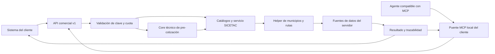

# Conectar un sistema o agente a SICETAC

Un tercero necesita la URL del servicio, su clave comercial y el contrato de consulta. La base de datos, el helper y el cálculo permanecen en el servidor de ATIEMPPO.

Esta guía describe el paquete implementado en el repositorio. La habilitación de cada cliente requiere que la versión comercial esté desplegada y que se complete una consulta real desde su entorno.

## Recorrido de conexión



El puente usa MCP por `stdio` en el equipo del cliente y HTTPS hacia ATIEMPPO. No crea un endpoint MCP HTTP público. Un cliente REST puede llamar la misma API sin instalar MCP.

## Responsabilidades

| ATIEMPPO | Integrador del cliente |
| --- | --- |
| Entregar URL del entorno y clave comercial individual por canal seguro | Guardar la clave como secreto del proceso o conector |
| Habilitar consumidor, alcance y cuota; verificar revocación | Configurar `SICETAC_BASE_URL` y `SICETAC_API_KEY` |
| Mantener catálogos, cortes y cálculo | Consultar catálogos y enviar selecciones explícitas |
| Operar datos y credenciales del servidor | Interpretar errores, variantes y periodos efectivos |
| Acompañar la prueba inicial con evidencia | Validar capacidad útil, acceso físico y condiciones del envío |

Las claves de Supabase y los tokens administrativos no se entregan al cliente. `GET /v1/health` verifica el endpoint de salud; no certifica acceso a datos ni que una cotización vaya a funcionar.

## Contrato HTTP

| Operación | Endpoint | Respuesta | Unidades de cotización |
| --- | --- | --- | --- |
| Salud | `GET /v1/health` | `status`, `api`, `version` | 0 |
| Municipios y aliases | `GET /v1/catalog/municipalities` | `items` | 0 |
| Configuraciones vehiculares | `GET /v1/catalog/vehicles` | `items` | 0 |
| Carrocerías y series | `GET /v1/catalog/body-types` | `items` | 0 |
| Cálculo | `POST /v1/quotes` | `data` y `meta` | 1 por intento admitido a cálculo |
| Pre-cotización técnica | `POST /v1/prequotes` | decisión técnica, referencia SICETAC y `meta` | 1 |
| Observación de vocabulario | `POST /v1/feedback/terms` | estado `pending_review` | 0 |
| Uso del consumidor | `GET /v1/usage` | `period`, `used`, `quota`, `remaining` | 0 |

Excepto salud, configura autenticación comercial `X-API-Key` o `Authorization: Bearer`. En el servidor, `SICETAC_API_ACCESS_MODE=api_key` es el modo para terceros; `public` sirve para demostraciones.

Una solicitud rechazada antes de reservar cuota, por ejemplo por autenticación o validación de esquema, no consume una unidad. Un fallo posterior a la admisión al cálculo puede consumirla. No reintentes automáticamente un timeout de cotización.

El esquema completo se publica por FastAPI en `/openapi.json` y puede explorarse en `/docs`, cuando esas rutas estén accesibles en el despliegue. Incluye también endpoints internos/legacy; el contrato de terceros es `/v1/*`.

## Cliente HTTP ejecutable

Requisitos: Python 3.10 o superior y un entorno virtual propio. Desde la raíz del repositorio:

```bash
python -m venv .venv-client
.venv-client/bin/python -m pip install -r requirements-client.txt
```

En Windows usa `.venv-client\Scripts\python.exe`. Configura en el entorno del proceso:

- `SICETAC_BASE_URL`: URL HTTPS base entregada por ATIEMPPO, sin `/v1` al final.
- `SICETAC_API_KEY`: clave comercial individual, cargada desde el gestor de secretos.

No existe URL productiva implícita ni clave embebida en el cliente. HTTP se admite únicamente contra loopback para pruebas locales. El cliente no sigue redirecciones con la clave.

```bash
.venv-client/bin/python commercial_client.py health
.venv-client/bin/python commercial_client.py municipalities
.venv-client/bin/python commercial_client.py vehicles
.venv-client/bin/python commercial_client.py body-types
.venv-client/bin/python commercial_client.py usage
.venv-client/bin/python commercial_client.py quote --payload examples/commercial-query.json
```

La última orden consume una cotización y utiliza los valores del archivo. Revisa el vehículo, carrocería, origen y destino antes de ejecutarla. Si omites `mes`, conserva el periodo efectivo de respuesta. Para reproducir un cálculo, envía el periodo que deba consultarse.

## Puente MCP para agentes

Ejecuta `commercial_mcp_server.py` con el mismo Python del entorno cliente. El proceso hereda `SICETAC_BASE_URL` y `SICETAC_API_KEY`.

Parámetros que deben registrarse en un host compatible con MCP por stdio:

```json
{
  "command": "/ruta/absoluta/.venv-client/bin/python",
  "args": ["/ruta/absoluta/sicetac-mcp-atiemppo/commercial_mcp_server.py"]
}
```

Este fragmento expresa el proceso MCP; no es un archivo de configuración universal de OpenClaw. El mecanismo para registrar servidores o conectores debe comprobarse en la versión e instalación del cliente. Las variables secretas se inyectan por el mecanismo del host, sin pegarlas en este JSON.

Herramientas del puente:

- `listar_municipios`: nombres, departamentos, aliases y códigos.
- `listar_vehiculos`: códigos, descripción y ejes disponibles.
- `listar_carrocerias`: etiquetas y columnas relacionadas con cada servicio.
- `consultar_consumo`: consumo y cuota.
- `cotizar_sicetac`: exige `origen`, `destino`, `vehiculo` y `carroceria`. También permite códigos DANE con nombres vacíos, periodo, variantes del ciclo de contenedor, horas logísticas y peajes. Conserva `data` y `meta`.
- `precotizar_transporte`: exige origen, destino, peso y unidad. El motor selecciona una configuración técnica y luego consulta SICETAC. Consume cuota y nunca emite un precio comercial.
- `registrar_termino_para_revision`: guarda un alias o forma de escribir como candidato. Su resultado `pending_review` no altera el motor.

`cotizar_sicetac` se declara como operación que consume cuota y no es idempotente. No activa consumidores ni concede accesos. El servidor anterior `mcp_server.py` ejecuta el servicio de cálculo directamente y requiere el entorno de datos de ATIEMPPO; para terceros utiliza el puente comercial.

## Interpretar la respuesta

1. Lee `data.resolved_route` y confirma municipios y departamentos. El helper puede resolver aliases o aproximaciones.
2. Comprueba `data.configuracion`, `data.carroceria`, `data.mes`, `data.mes_parametros` y `data.metodo` cuando estén presentes.
3. Si existe `data.variantes`, selecciona la variante aplicable con su `RUTASID` antes de comparar costos; no sumes rutas alternativas.
4. En ciclos de contenedor con `requiere_seleccion_ruta`, repite con `rutasid_ida` y `rutasid_regreso` de las alternativas elegidas.
5. Compara escenarios `H2`, `H4` o `H8` equivalentes; conserva `meta.request_id` y el consumo informado.
6. Si hay error, conserva su estado y el contexto no secreto. El cliente muestra mensajes resumidos sin reenviar errores internos del servidor.

Consulta el [mapa de relaciones](data-relationships.md) para entender cómo se enlazan entradas, catálogos y resultados.

## Prueba de aceptación del cliente

1. Clave inválida: respuesta `401` en un recurso protegido, sin cálculo.
2. Clave válida: catálogos legibles y consumo inicial consultable.
3. Una consulta controlada: ruta, configuración, carrocería, periodo y resultado comprobables; identificador de solicitud conservado.
4. Comparación de dos vehículos: mismos criterios y capacidades útiles obtenidas de una fuente del cliente.
5. Municipio ambiguo, variante o cobertura ausente: el agente informa la condición y no inventa una respuesta.
6. Cuota agotada y revocación: comprobar en consumidor de pruebas administrado por ATIEMPPO.
7. Evidencia: fecha, entorno, versión, petición sin secretos, respuesta y resultado esperado/obtenido.

## Estado y pendientes de operación

Las pruebas automáticas del repositorio pueden ejercitar el puente, el cliente HTTP y FastAPI con datos simulados. No certifican la instalación de OpenClaw del cliente ni el despliegue público.

La implementación local incorpora expiración de consumidores y reserva atómica persistente mediante `supabase/migrations/20260912161629_api_consumers_expiration_and_reservations.sql`. La reserva usa una función RPC con bloqueo de fila; el cierre actualiza el estado de la reserva y `GET /v1/usage` consulta el total del periodo mediante otra función RPC. La prueba automática cubre el uso de la reserva persistente con un cliente simulado.

Esto todavía no acredita operación productiva. Antes de ofrecer garantías de cuota hay que aplicar ambas migraciones en una ventana controlada, verificar que las funciones quedan disponibles para `service_role`, crear un consumidor de prueba con `activated_at` y `expires_at`, y comprobar en el entorno desplegado acceso válido, expiración, revocación, cuota agotada y fallo de auditoría. Si `SICETAC_USAGE_PERSISTENCE` está desactivado, el modo en memoria pierde el consumo al reiniciar y solo sirve para pruebas locales.

Además, los endpoints legacy continúan disponibles para integraciones anteriores. Su alcance debe revisarse en el despliegue antes de prometer control comercial sobre toda consulta. La activación comercial se completa con la [guía de operación](commercial-api.md), una revisión del despliegue y la aceptación real del cliente.
